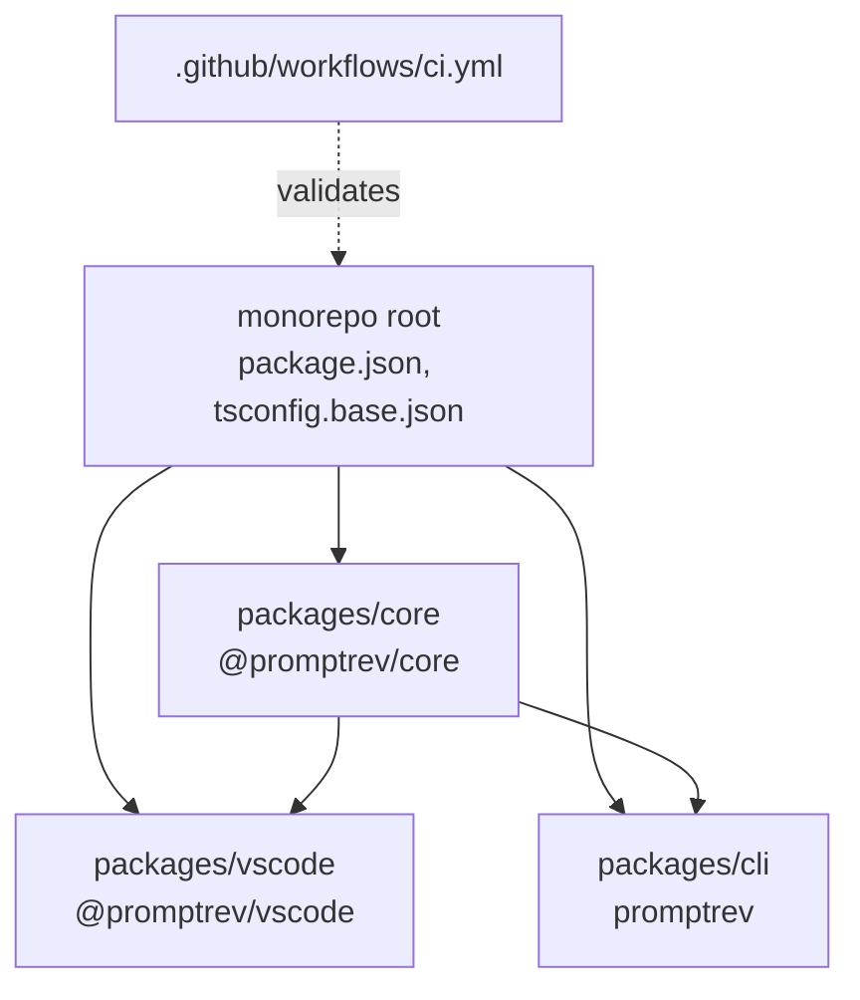

# Contributing to PromptRev

Thanks for your interest in contributing. This document covers how the repo is structured, how to get set up locally, and the conventions we follow.

## Prerequisites

| Tool | Version | Why |
|---|---|---|
| Node.js | ≥ 18 | Runtime for all packages |
| pnpm | ≥ 9 | Monorepo package manager |
| VS Code | ≥ 1.85.0 | Extension development and testing |
| Git | any | Version control |

Install pnpm if you don't have it:

```bash
npm install -g pnpm
```

## Local setup

```bash
# Clone the repo
git clone https://github.com/SirArnoldB/promptrev.git
cd promptrev

# Install all workspace dependencies in one command
pnpm install
```

## Build order

The packages have a dependency chain. Always build in this order:

```
core  →  vscode  →  cli
```

`vscode` and `cli` both depend on `@promptrev/core`. If `core` isn't built first, their TypeScript compilation will fail.

```bash
# Build everything in the right order
pnpm build:core
pnpm --filter @promptrev/vscode build
pnpm --filter promptrev build          # once cli package exists
```

Or build everything at once (root script respects order):

```bash
pnpm build
```

## Development workflow

### Working on `core`

```bash
pnpm --filter @promptrev/core watch    # rebuild on file change
pnpm --filter @promptrev/core test     # run unit tests
pnpm --filter @promptrev/core typecheck
```

### Working on the VS Code extension

```bash
# Keep core in watch mode in one terminal
pnpm --filter @promptrev/core watch

# Build the extension in another terminal
pnpm --filter @promptrev/vscode watch

# Then press F5 in VS Code to launch an Extension Development Host
```

The Extension Development Host opens a new VS Code window with the extension loaded. Changes to the extension require rebuilding and re-launching (Ctrl+R in the dev host window).

### Working on the CLI

```bash
pnpm --filter promptrev watch
```

## Running tests

```bash
# All packages
pnpm test

# Core only
pnpm --filter @promptrev/core test

# Watch mode
pnpm --filter @promptrev/core test:watch
```

## Package structure overview



### `packages/core`

The enhancement engine. Pure TypeScript — no VS Code API, no filesystem, no HTTP. Contains:
- `enhancer.ts` — `enhance()` orchestrator
- `modifiers.ts` — 7 built-in modifier definitions + `resolveModifier()`
- `model-adapter.ts` — `ModelAdapter` interface + `RuleBasedAdapter`
- `diff.ts` — word-level diff utilities
- `history.ts` — `HistoryManager` with pluggable storage
- `rule-based.ts` — `:fast` mode, deterministic text cleanup

### `packages/vscode`

The VS Code extension. Registers the `@rev` chat participant, the `Cmd+Shift+E` keybinding command, and the history sidebar panel. Implements `VSCodeModelAdapter` using `vscode.lm`. Depends on `@promptrev/core`.

### `packages/cli` _(coming soon)_

The npm CLI and SDK package. Implements `AnthropicModelAdapter` using the Anthropic SDK. Depends on `@promptrev/core`.

## Branching and PR conventions

### Branch naming

```
feat/<short-description>      # new feature
fix/<short-description>       # bug fix
docs/<short-description>      # documentation only
infra/<short-description>     # CI, build, tooling
refactor/<short-description>  # no behaviour change
```

### Commit messages

We use conventional commit style:

```
feat: add :spec modifier system prompt
fix: handle AbortError propagation in enhance()
docs: add core package API reference
infra: add Node 20 to CI matrix
```

### Pull requests

- **One concern per PR** — keep PRs small and focused
- **Tag the issue** — every PR should close at least one issue with `Closes #N`
- **Tests required** — new behaviour in `core` needs unit tests
- **No broken builds** — CI must pass before merge (build + typecheck + tests)

## CI pipeline

Every push to `main` and every PR runs:

```
install dependencies
    ↓
build @promptrev/core
    ↓
typecheck @promptrev/vscode
    ↓
build @promptrev/vscode
    ↓
test @promptrev/core
    ↓
VSIX package dry-run
```

Runs on Node 18 and Node 20. See [`.github/workflows/ci.yml`](.github/workflows/ci.yml).

## Adding a new modifier

1. Add the modifier definition to `packages/core/src/modifiers.ts` in `BUILT_IN_MODIFIERS`
2. Add the modifier as a command in `packages/vscode/package.json` under `contributes.chatParticipants[0].commands`
3. Add a test case in `packages/core/src/__tests__/modifiers.test.ts`
4. Update the modifier table in `packages/vscode/README.md` and the root `README.md`

## Questions?

Open an issue or start a discussion on GitHub.
