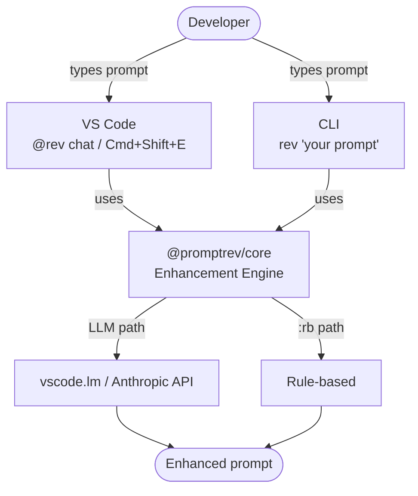
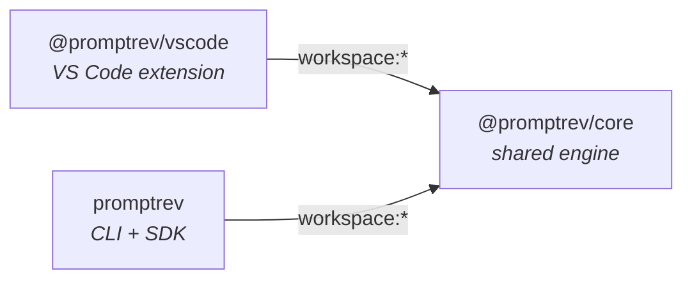

# PromptRev

> Instantly enhance your AI prompts with `@rev` — VS Code extension, CLI, and SDK.

PromptRev is a developer tool that automatically enhances, polishes, and refines prompts before they are sent to an AI agent. It works as a VS Code extension, a CLI npm package, and a standalone SDK — meeting developers wherever they work.

## How it works



## Package architecture



`core` has zero platform dependencies — no VS Code, no Node I/O. Both `vscode` and `cli` adapt it to their environment through the `ModelAdapter` interface.

## Features

- **`@rev` Chat Participant** — type `@rev your prompt` in VS Code Chat for instant enhancement
- **Global keybinding** — `Cmd+Shift+E` / `Ctrl+Shift+E` to enhance selected text in any editor
- **Modifier system** — `:rb`, `:deep`, `:architect`, `:critic`, `:spell`, `:spec`, and custom
- **No extra API key needed** — reuses your existing Copilot/Claude model via `vscode.lm`
- **Prompt history panel** — review, restore, and export past enhancements
- **CLI + SDK** — use from the terminal or integrate into your own tools

## Modifier quick reference

| Modifier | Best for | Auto-send | Latency |
|---|---|---|---|
| `@rev` (default) | Everyday prompts | Off | ~400ms |
| `@rev /rb` | High-velocity flow | On | ~0ms (rule-based) |
| `@rev:deep` | Architecture, complex tasks | Off | ~700ms |
| `@rev:architect` | System design, trade-offs | Off | ~600ms |
| `@rev:critic` | Code review, security audits | Off | ~500ms |
| `@rev:spell` | Grammar/spelling only | Off | ~300ms |
| `@rev:spec` | Idea → acceptance criteria | Off | ~600ms |

## Monorepo structure

```
promptrev/
├── packages/
│   ├── core/        ← @promptrev/core  — shared enhancement engine
│   ├── vscode/      ← @promptrev/vscode — VS Code extension
│   └── cli/         ← promptrev        — CLI tool and SDK (coming soon)
├── docs/            ← PRD, technical spec, design decisions
├── .github/
│   └── workflows/
│       └── ci.yml   ← GitHub Actions CI
└── ...
```

## Getting started (development)

```bash
# Prerequisites: Node ≥18, pnpm ≥9
npm install -g pnpm

# Install all workspace dependencies
pnpm install

# Build in dependency order
pnpm build:core
pnpm --filter @promptrev/vscode build

# Run all tests
pnpm test

# Watch mode (core)
pnpm --filter @promptrev/core watch
```

## Usage — VS Code

Install the extension, then in any VS Code Chat panel:

```
@rev fix the bug in my auth module
@rev /rb fix null check on user.profile
@rev:deep design a scalable notification system
@rev:architect design a job queue with retry logic
@rev:critic review my authentication implementation
@rev:spell does this endpoint handel concurrent request proprly
@rev:spec add user invite feature to the dashboard
```

Or select any text in the editor and press `Cmd+Shift+E` (`Ctrl+Shift+E` on Windows/Linux).

## Usage — CLI

```bash
# Enhance a prompt
npx promptrev "fix the race condition in my queue worker"

# With a modifier
rev --mod deep "design a job queue system"

# Pipe from stdin
echo "fix null check" | rev --mod rb

# JSON output
rev --json "design a caching layer"
```

## Packages

| Package | Description | Registry |
|---|---|---|
| [`@promptrev/core`](packages/core) | Enhancement engine — pure TypeScript, no platform deps | npm (internal) |
| [`@promptrev/vscode`](packages/vscode) | VS Code / Visual Studio extension | VS Code Marketplace |
| [`promptrev`](packages/cli) | CLI tool and SDK | npm |

## Contributing

See [CONTRIBUTING.md](CONTRIBUTING.md) for dev setup, build order, and PR conventions.

## License

MIT
