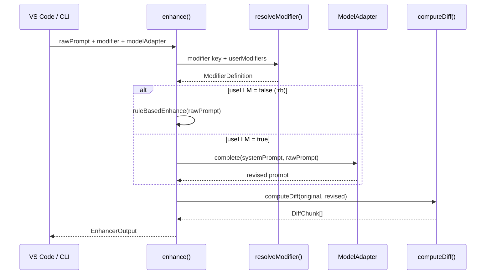
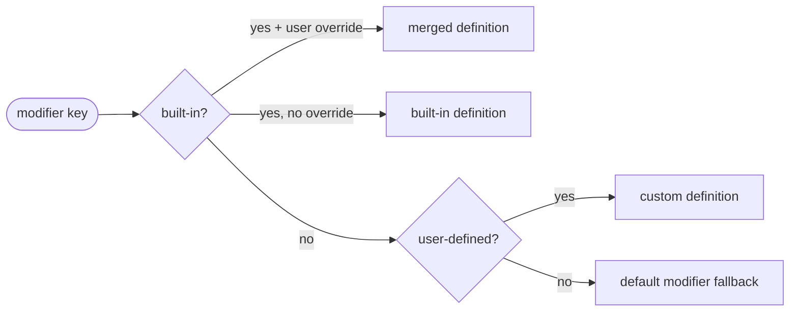

# @promptrev/core

> The shared enhancement engine for PromptRev — pure TypeScript, no platform dependencies.

This package contains all the business logic for prompt enhancement. It has no dependency on VS Code, the Node.js filesystem, or any specific LLM provider. Both the VS Code extension and CLI adapt it to their environment through the `ModelAdapter` interface.

## How a prompt flows through core



## Modifier resolution



## Installation

This package is internal to the PromptRev monorepo. It is referenced by `@promptrev/vscode` and `promptrev` (CLI) via `workspace:*`.

If you want to use the enhancement engine in your own project:

```bash
npm install @promptrev/core
```

## API

### `enhance(input)`

The main entry point. Takes a raw prompt and returns an enhanced version.

```typescript
import { enhance, RuleBasedAdapter } from '@promptrev/core';

const result = await enhance({
  rawPrompt: 'fix the race condition in my queue worker',
  modifier: 'deep',
  domainContext: 'Node.js, Bull queue, Redis',
  modelAdapter: new AnthropicModelAdapter({ apiKey: process.env.ANTHROPIC_API_KEY }),
});

console.log(result.revised);
// → "Identify and fix the race condition in the queue worker.
//    Focus on: concurrent job pickup, lock mechanisms, and
//    ensuring idempotency. Explain the root cause and the fix."
```

**Input:**

| Field | Type | Required | Description |
|---|---|---|---|
| `rawPrompt` | `string` | Yes | The prompt to enhance |
| `modifier` | `ModifierKey \| string` | Yes | Which modifier to apply |
| `modelAdapter` | `ModelAdapter` | Yes | LLM or rule-based adapter |
| `domainContext` | `string` | No | Tech stack hint injected into system prompt |
| `userModifiers` | `Record<string, Partial<ModifierDefinition>>` | No | Custom or override modifier definitions |
| `signal` | `AbortSignal` | No | Cancellation signal |

**Output (`EnhancerOutput`):**

| Field | Type | Description |
|---|---|---|
| `original` | `string` | The raw input prompt |
| `revised` | `string` | The enhanced prompt |
| `modifier` | `string` | Modifier key used |
| `timestamp` | `number` | Unix ms timestamp |
| `skipped` | `boolean` | `true` if prompt was too short or unchanged |
| `diff` | `DiffChunk[]` | Word-level diff between original and revised |

---

### `resolveModifier(key, userModifiers?)`

Resolves a modifier key to its full `ModifierDefinition`. User-defined overrides are merged on top of built-in defaults.

```typescript
import { resolveModifier } from '@promptrev/core';

const mod = resolveModifier('deep');
// → { key: 'deep', useLLM: true, acceptMode: 'diff', autoSend: false, ... }

// With user override
const mod2 = resolveModifier('deep', { deep: { autoSend: true } });
// → { ...deepDefaults, autoSend: true }

// Custom modifier
const mod3 = resolveModifier('backend', {
  backend: {
    systemPrompt: 'Rewrite for a Node.js + PostgreSQL backend...',
    acceptMode: 'diff',
  },
});
```

---

### `ModelAdapter` interface

The abstraction that decouples the enhancement engine from any specific LLM. Implement this interface to connect any model.

```typescript
export interface ModelAdapter {
  complete(
    systemPrompt: string,
    userMessage: string,
    signal?: AbortSignal
  ): Promise<string>;
}
```

**Provided adapters:**

| Adapter | Location | Use case |
|---|---|---|
| `RuleBasedAdapter` | `@promptrev/core` | `:rb` mode, no LLM, |
| `VSCodeModelAdapter` | `@promptrev/vscode` | VS Code extension via `vscode.lm` |
| `AnthropicModelAdapter` | `promptrev` (CLI) | CLI via Anthropic SDK |

**Example — custom adapter:**

```typescript
import type { ModelAdapter } from '@promptrev/core';

class MyOpenAIAdapter implements ModelAdapter {
  async complete(systemPrompt: string, userMessage: string): Promise<string> {
    const res = await openai.chat.completions.create({
      model: 'gpt-4o-mini',
      messages: [
        { role: 'system', content: systemPrompt },
        { role: 'user', content: userMessage },
      ],
    });
    return res.choices[0].message.content ?? '';
  }
}
```

---

### Built-in modifiers

| Key | `useLLM` | `acceptMode` | `autoSend` | Description |
|---|---|---|---|---|
| `default` | true | diff | false | Clarity, structure, context injection |
| `rb` | false | auto | true | Rule-based only — |
| `deep` | true | diff | false | Chain-of-thought, edge cases, structure |
| `architect` | true | diff | false | System design, trade-offs, scalability |
| `critic` | true | diff | false | Adversarial review, failure modes |
| `spell` | true | diff | false | Grammar and spelling only |
| `spec` | true | diff | false | Idea → structured spec + acceptance criteria |

---

### `HistoryManager`

Manages a capped, ordered list of enhancement history entries with pluggable storage.

```typescript
import { HistoryManager, InMemoryStorage } from '@promptrev/core';

const history = new HistoryManager(new InMemoryStorage(), 100);

const entry = history.add({
  original: 'fix the bug',
  revised: 'Fix the null pointer bug in the auth module.',
  modifier: 'default',
  accepted: true,
});

history.getAll();       // newest-first
history.restore(entry.id); // → 'fix the bug'
history.export();       // → JSON string
history.clear();
```

Implement `HistoryStorage` to plug in persistent storage (e.g. VS Code `globalState`):

```typescript
import type { HistoryStorage, HistoryEntry } from '@promptrev/core';

class VSCodeStorage implements HistoryStorage {
  constructor(private context: vscode.ExtensionContext) {}
  get() { return this.context.globalState.get<HistoryEntry[]>('history', []); }
  set(entries: HistoryEntry[]) { this.context.globalState.update('history', entries); }
}
```

---

### Diff utilities

```typescript
import { computeDiff, formatDiffMarkdown } from '@promptrev/core';

const chunks = computeDiff('fix the bug', 'Fix the null pointer bug.');
// → [{ type: 'delete', value: 'fix' }, { type: 'insert', value: 'Fix' }, ...]

formatDiffMarkdown('fix the bug', 'Fix the null pointer bug.');
// → "**Original:**\n> fix the bug\n\n**Revised:**\n> Fix the null pointer bug."
```

---

### `ruleBasedEnhance(raw)`

Applies deterministic text transformations — used by `:rb` mode.

```typescript
import { ruleBasedEnhance } from '@promptrev/core';

ruleBasedEnhance('fix the recieve function idk');
// → 'Fix the receive function.'
```

Rules applied in order:
1. Fix common developer typos (`recieve` → `receive`, `databse` → `database`, etc.)
2. Remove filler phrases (`idk`, `or something`, `maybe`, `kinda`, etc.)
3. Prepend `Please` if no imperative verb detected
4. Capitalize first letter
5. Ensure ends with punctuation

## Module structure

```
src/
├── index.ts          ← public API re-exports
├── enhancer.ts       ← enhance() orchestrator
├── modifiers.ts      ← built-in modifier definitions + resolveModifier()
├── model-adapter.ts  ← ModelAdapter interface + RuleBasedAdapter
├── diff.ts           ← computeDiff(), formatDiffMarkdown()
├── history.ts        ← HistoryManager, HistoryStorage, InMemoryStorage
└── rule-based.ts     ← ruleBasedEnhance() — :rb mode logic
```

## Development

```bash
# Build (CJS + ESM + .d.ts)
pnpm --filter @promptrev/core build

# Watch mode
pnpm --filter @promptrev/core watch

# Tests
pnpm --filter @promptrev/core test

# Typecheck only
pnpm --filter @promptrev/core typecheck
```
