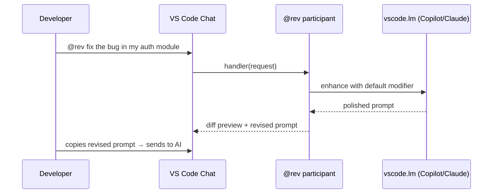
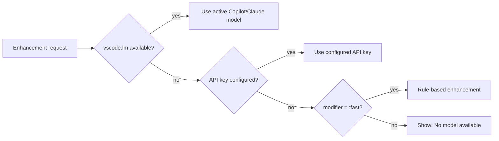

# PromptRev — VS Code Extension

> Instantly enhance your AI prompts with `@rev` — before you send them.

PromptRev makes every developer a prompt engineer without them needing to think about it. Type `@rev your rough prompt` in any VS Code Chat panel and get a polished, context-aware version back in under a second — with a diff showing exactly what changed.

## How it works



No separate API key required. PromptRev reuses whatever model you already have active (GitHub Copilot, Claude, etc.) via VS Code's `vscode.lm` API. If no model is available, it falls back to rule-based enhancement automatically.

## Features

- **`@rev` Chat Participant** — first-class VS Code Chat integration with autocomplete
- **6 built-in modifiers** — `:fast`, `:deep`, `:architect`, `:critic`, `:spell`, `:spec`
- **`Cmd+Shift+E`** — enhance selected text in any editor without opening chat
- **Diff preview** — see exactly what changed before accepting
- **Prompt history panel** — restore, review, and export past enhancements
- **Zero setup** — no API key, no background process, works with your existing model
- **Custom modifiers** — define team-specific enhancement rules in `.promptrev.json`

## Usage

### `@rev` in VS Code Chat

Type `@rev` followed by your prompt in any VS Code Chat panel:

```
@rev fix the bug in my auth module
```

PromptRev intercepts the message, enhances it, and returns a diff preview with the revised prompt ready to copy.

### Modifiers

Append a modifier with `/` in the chat command:

| Command | Best for |
|---|---|
| `@rev` | Everyday prompts — clarity, structure, context |
| `@rev /fast` | In-flow quick fixes — rule-based, zero latency, auto-accept |
| `@rev /deep` | Complex tasks — chain-of-thought, edge cases, structure |
| `@rev /architect` | System design — trade-offs, components, scalability |
| `@rev /critic` | Code review — failure modes, security, assumptions |
| `@rev /spell` | Grammar and spelling only — no restructuring |
| `@rev /spec` | Convert a vague idea into a structured spec |

### Keybinding — enhance selected text

Select any text in the editor and press `Cmd+Shift+E` (Mac) or `Ctrl+Shift+E` (Windows/Linux):

1. Select your rough prompt text in any file
2. Press the keybinding
3. Choose **Replace Selection**, **Copy to Clipboard**, or **Dismiss**

Works in `.md` files, scratch files, code comments — anywhere you draft prompts.

## Configuration

All settings live in VS Code `settings.json` under the `promptrev.*` namespace:

```json
{
  "promptrev.acceptMode": "diff",
  "promptrev.autoSend": false,
  "promptrev.keepHistory": true,
  "promptrev.maxHistory": 100,
  "promptrev.domainContext": "React + TypeScript, Node.js, PostgreSQL",
  "promptrev.modifiers": {
    "fast": { "autoSend": true },
    "backend": {
      "systemPrompt": "Rewrite for a TypeScript/Express backend. Always include error handling, input validation, and Prisma/PostgreSQL context.",
      "acceptMode": "diff"
    }
  }
}
```

| Setting | Default | Description |
|---|---|---|
| `promptrev.acceptMode` | `"diff"` | `"diff"` shows a preview, `"auto"` accepts immediately |
| `promptrev.autoSend` | `false` | Auto-send accepted prompt to the AI |
| `promptrev.keepHistory` | `true` | Track enhancement history |
| `promptrev.maxHistory` | `100` | Max history entries (1–500) |
| `promptrev.domainContext` | `""` | Tech stack injected into every enhancement |
| `promptrev.modifiers` | `{}` | Custom or overridden modifier definitions |

### Project-level config

Create a `.promptrev.json` at the workspace root to share modifier definitions with your team:

```json
{
  "modifiers": {
    "backend": {
      "systemPrompt": "Rewrite this prompt for a Node.js + Express + PostgreSQL + Prisma backend. Include TypeScript, JWT auth, error handling, and input validation in every response.",
      "acceptMode": "diff"
    },
    "frontend": {
      "systemPrompt": "Rewrite this prompt for a React + TypeScript frontend. Include accessibility, component structure, and state management considerations.",
      "acceptMode": "diff"
    }
  }
}
```

## Model fallback chain



## Requirements

- VS Code `^1.85.0`
- GitHub Copilot (recommended) or another VS Code language model extension

## Development

```bash
# From monorepo root
pnpm install
pnpm build:core

# Build the extension
pnpm --filter @promptrev/vscode build

# Watch mode
pnpm --filter @promptrev/vscode watch

# Press F5 in VS Code to launch Extension Development Host
```
